<div align="center">



<br/>

<h1>
  
  &nbsp;RASAD&nbsp;|&nbsp;رصد
</h1>

<p>
  <strong>منصة عربية للتحقق من الأخبار، مدعومة بستة وكلاء ذكاء اصطناعي</strong><br/>
  <em>Arabic AI fact-checking platform — 6 specialized agents, real-time, free.</em>
</p>

<p>
  <a href="#-quick-start"></a>
  <a href="#-architecture"></a>
  <a href="./DEPLOY.md"></a>
</p>

<p>
  
  
  
  
  
  
</p>

<p>
  <a href="https://github.com/aboodhaymouni/rasad-platform">🔗 GitHub Repo</a>
  &nbsp;·&nbsp;
  <a href="./DEPLOY.md">📘 Deployment Guide</a>
  &nbsp;·&nbsp;
  <a href="#-the-6-agents">🤖 Meet the Agents</a>
  &nbsp;·&nbsp;
  <a href="#-team">👥 Team</a>
</p>

</div>

---

## 🎯 ما هو RASAD؟

ألصق ادعاءً، رابط مقالة، أو ارفع صورة — يبحث رصد في الإنترنت، يقارن المحتوى مع 10 مصادر عربية موثوقة + بحث ويب حي عبر 7 محركات، ويُرجِع حكماً مع أدلة قابلة للتتبع خلال **10–15 ثانية**.

> **بدون تسجيل · بدون بطاقة بنكية · كل الميزات مجانية**

```
verdict: VERIFIED · FALSE · MISLEADING · AI_GENERATED · MANIPULATED
       · OLD_NEWS · UNVERIFIED · DUPLICATE · HIGH_RISK
confidence: 0..100
arabic_explanation: 3-sentence Gemini-synthesized explanation
agent_breakdown: per-agent scores + evidence + sources
```

<div align="center">

🇯🇴 **مشروع مقدَّم لمسابقة جامعة الزيتونة الأردنية — مايو 2026**

</div>

---

## ✨ الميزات

<table>
<tr>
<td width="33%" valign="top">

### 🤖 6 وكلاء ذكاء اصطناعي

تحليل لغوي عربي، أصالة الوسائط، تدقيق المصادر، كشف التضليل، تتبّع الادعاء، محرّك حكم Gemini 2.5

</td>
<td width="33%" valign="top">

### 🌐 بحث حي على الإنترنت

7 محركات بحث: Brave · Tavily · Serper · Bing · DuckDuckGo · SearXNG · Wikipedia

</td>
<td width="33%" valign="top">

### 📰 مراقبة مستمرة

10 مصادر RSS عربية، يحلّلها backend كل 4 دقائق ويصنّفها بمخاطر مباشرة

</td>
</tr>
<tr>
<td valign="top">

### 🖼️ كشف صور AI

نموذج `Organika/sdxl-detector` محلياً + EXIF metadata + Hive (اختياري)

</td>
<td valign="top">

### ⚡ بدون login

تحقق فوري + history في localStorage + export CSV/JSON للنتائج

</td>
<td valign="top">

### 🇯🇴 عربي أولاً

RTL كامل · Noto Kufi Arabic · شروحات بالعربية الفصحى عبر Gemini

</td>
</tr>
</table>

---

## 🚀 Quick Start

### الطريقة الأسهل — Docker Compose

```bash
git clone https://github.com/aboodhaymouni/rasad-platform.git
cd rasad-platform
cp backend/.env.example backend/.env       # ضع GEMINI_API_KEY
cp .env.example .env
docker compose up -d --build

# Frontend  → http://localhost:8080
# Backend   → http://localhost:8000
# OpenAPI   → http://localhost:8000/docs
```

### التطوير اليدوي — Backend

```bash
cd backend
python -m venv .venv
.venv\Scripts\activate                     # Windows
# source .venv/bin/activate                # macOS/Linux
pip install -r requirements.txt
cp .env.example .env                       # GEMINI_API_KEY (اختياري)
python -m uvicorn main:app --host 127.0.0.1 --port 8000
```

### التطوير اليدوي — Frontend

```bash
npm install
cp .env.example .env
npm run dev
# → http://localhost:8080
```

> أول طلب verify يأخذ ~30 ثانية (تنزيل HuggingFace models). بعدها 10–15 ثانية لكل verdict.

---

## 🏗️ Architecture

```
┌───────────────────────────────────────────────────────────────────────────┐
│                         RASAD Platform                                     │
└───────────────────────────────────────────────────────────────────────────┘

┌─────────────────────────────────┐         ┌──────────────────────────────┐
│  Landing  ◄── /                 │         │  Verify    ◄── /verify       │
│   • Hero + entrance animations  │         │   • text / url / image       │
│   • LiveTicker (12s polling)    │         │   • no login required        │
│   • Embedded PublicVerify       │         │   • localStorage history     │
└─────────────────────────────────┘         │   • CSV / JSON export        │
                                            └──────────────────────────────┘
                                                          │
                                                          ▼ HTTP (FastAPI)
                                            ┌──────────────────────────────┐
                                            │  MainOrchestrator            │
                                            │   asyncio.gather(parallel)   │
                                            └──────────────────────────────┘
                                                          │
        ┌───────────────────────┬─────────────────────────┼──────────────┬─────────────┐
        ▼                       ▼                         ▼              ▼             ▼
   ┌─────────┐            ┌──────────┐            ┌──────────────┐ ┌─────────┐  ┌──────────┐
   │  A1     │            │  A3      │            │  A4          │ │  A2     │  │  A5      │
   │ Arabic  │            │ Reference│  ←── RSS + │  ML Fake     │ │ Media   │  │ Claim    │
   │ NLP     │            │ Checker  │  7 search  │  News BERT   │ │ Auth    │  │ Tracer   │
   └─────────┘            │          │  + scrape  │  ensemble    │ │ (image) │  │          │
                          └──────────┘            └──────────────┘ └─────────┘  └──────────┘
                                                          │
                                                          ▼
                                            ┌──────────────────────────────┐
                                            │  A6 VerdictEngine            │
                                            │  Gemini 2.5 Flash synthesis  │
                                            │  + Arabic explanation        │
                                            └──────────────────────────────┘
                                                          │
                                                          ▼
                                            ┌──────────────────────────────┐
                                            │  FinalVerdict                │
                                            │  + sources[]                 │
                                            │  + agent_breakdown           │
                                            └──────────────────────────────┘
```

---

## 🤖 The 6 Agents

| # | Agent | Models / APIs | Job |
|---|-------|---------------|-----|
| **A1** | Arabic NLP | CAMeL-BERT sentiment + manipulation regex | Detect emotional manipulation, classify topic, urgency markers |
| **A2** | Media Authenticity | Hive API → `Organika/sdxl-detector` → EXIF | AI-generated/deepfake/metadata tampering detection |
| **A3** | Reference Checker | sentence-transformers + 10 RSS + 7 search engines | Cross-reference claim vs trusted Arabic sources |
| **A4** | ML Fake News | BERT ensemble + linguistic-pattern detection | Misinformation probability + red flags |
| **A5** | Claim Tracer | Origin + propagation timeline + domain credibility | First publisher, spread window, credibility score |
| **A6** | Verdict Engine | Gemini 2.5 Flash | Weighted score + 3-sentence Arabic explanation |

---

## 🌐 Web Search Stack

> Tries providers in priority order — **زيرو keys = still works** عبر Bing HTML + DuckDuckGo + public SearXNG + Wikipedia

```
Brave > Tavily > Serper > Bing(HTML) > DuckDuckGo > SearXNG > Wikipedia
```

---

## 📡 API Endpoints

```http
GET  /api/v1/health                       خدمة الحالة + status لكل service
POST /api/v1/verify/text     {text}       → FinalVerdict
POST /api/v1/verify/url      {url}        → FinalVerdict (يستخرج المقالة)
POST /api/v1/verify/media    multipart    → FinalVerdict (A2 يفعّل)
GET  /api/v1/verify/{id}                  → استرجاع حكم محفوظ
GET  /api/v1/search?q=..&comprehensive=true&scrape=true
GET  /api/v1/live/feed?limit=&risk=&domain=
GET  /api/v1/live/stats
POST /api/v1/live/refresh                 فرض دورة بحث جديدة الآن
GET  /api/v1/stats                        عدّادات لكل verdict label
```

OpenAPI Swagger UI: `http://localhost:8000/docs`

---

## ⚙️ Environment Variables

<details>
<summary><b>Backend</b> — <code>backend/.env</code></summary>

```bash
# المفتاح الوحيد المُوصى به (مجاني عبر Google AI Studio)
GEMINI_API_KEY=

# اختيارية — تتفعّل تلقائياً عند الإضافة
HF_API_TOKEN=                    # HuggingFace Inference API
HIVE_API_KEY=                    # كشف صور AI احترافي
BRAVE_API_KEY=                   # 2000 استعلام/شهر
TAVILY_API_KEY=                  # 1000 استعلام/شهر
SERPER_API_KEY=                  # 2500 استعلام مجاناً

# Storage
SUPABASE_URL=
SUPABASE_SERVICE_ROLE_KEY=
REDIS_URL=redis://localhost:6379

# App
ENVIRONMENT=development
LOG_LEVEL=INFO
RASAD_LIVE_MONITOR=1
LIVE_MONITOR_INTERVAL=240
A2_AI_DETECTOR_MODEL=Organika/sdxl-detector
GEMINI_MODEL=gemini-2.5-flash
CORS_ORIGINS=http://localhost:8080
```
</details>

<details>
<summary><b>Frontend</b> — <code>.env</code></summary>

```bash
VITE_RASAD_API_URL=http://localhost:8000/api/v1
VITE_SUPABASE_URL=...
VITE_SUPABASE_PUBLISHABLE_KEY=...
```
</details>

> ⚠️ **`.env` مُستثنى من `.gitignore`** — لا يُرفع على GitHub أبداً. للنشر، انقل المفاتيح يدوياً للـ VPS.

---

## 🎨 Verdict Labels

<table>
<tr>
<td>🟢 <code>VERIFIED</code></td>
<td>verified-green <code>#1A8A5A</code></td>
<td>A3 ≥ 0.85 with ≥2 trusted matches</td>
</tr>
<tr>
<td>🔴 <code>FALSE</code></td>
<td>signal-red <code>#C8392D</code></td>
<td>A4 ≥ 0.75, no source matches</td>
</tr>
<tr>
<td>🟡 <code>MISLEADING</code></td>
<td>amber <code>#E8A020</code></td>
<td>weighted 0.55–0.75, partial truth</td>
</tr>
<tr>
<td>🔵 <code>AI_GENERATED</code></td>
<td>cyan <code>#6B9BD4</code></td>
<td>A2 detects AI signatures</td>
</tr>
<tr>
<td>🟣 <code>MANIPULATED</code></td>
<td>purple</td>
<td>A2 detects metadata tampering / cropping</td>
</tr>
<tr>
<td>⚪ <code>OLD_NEWS</code></td>
<td>grey</td>
<td>A5 origin > 180 days, A3 matches</td>
</tr>
<tr>
<td>⚪ <code>UNVERIFIED</code></td>
<td>white</td>
<td>insufficient evidence</td>
</tr>
<tr>
<td>⚫ <code>DUPLICATE</code></td>
<td>dark grey</td>
<td>content hash hit cache</td>
</tr>
<tr>
<td>🚨 <code>HIGH_RISK</code></td>
<td>red (pulsing)</td>
<td>A3 ≤ 0.30 + A4 ≥ 0.55 (no sources but flagged)</td>
</tr>
</table>

---

## 🚢 النشر

> **❓ هل أحتاج إعداد أم بس أعطي الرابط؟**
>
> **لا — الرابط وحده لا يكفي.** الـ backend (Python + AI models) يحتاج VPS، والمفاتيح يجب وضعها يدوياً (مش في الـ repo). الخبر السار: عندنا سكربت يخلّي كل ذلك دقيقتين.

### ⚡ الطريقة الأسرع — سطر واحد على VPS

```bash
curl -fsSL https://raw.githubusercontent.com/aboodhaymouni/rasad-platform/main/deploy.sh | bash
```

السكربت يقوم بكل شيء آلياً:
- ✅ يثبّت Docker + Docker Compose
- ✅ يستنسخ الـ repo
- ✅ ينشئ ملفات `.env` من القوالب
- ✅ يفتح الـ firewall ports
- ✅ يبني ويشغّل الـ containers
- ✅ يفحص الصحة

**الخطوات اليدوية المتبقّية بعد السكربت:**
1. ضع مفاتيحك في `backend/.env` (السكربت ينشئ الملف ويُذكّرك)
2. (اختياري) اربط دومين + SSL عبر nginx + certbot

### ❌ Hostinger Shared Hosting لن يعمل

السبب: Shared hosting ما يدعم Python أو Docker. الـ backend يحتاج بيئة كاملة.

**الحلّ:** Hostinger **VPS** (KVM 2 — 4GB RAM، ~$8/شهر).

### ✅ الفرق بين Frontend وحده والنظام الكامل

| النشر | يعمل على | الميزات الفعّالة |
|-------|---------|-------------------|
| Frontend فقط (static) | Shared / Cloud / Netlify | الواجهة فقط — لا تحقق، لا live ticker، لا حكم |
| **النظام الكامل** | **VPS مع Docker** | كل الميزات — 6 وكلاء، تحقق فوري، live monitor |

> **➡️ التفاصيل الكاملة (nginx + SSL + DNS + monitoring):** [DEPLOY.md](./DEPLOY.md)

---

## 🛠️ Tech Stack

<table>
<tr>
<td valign="top" width="50%">

**Frontend**
- React 18 + TypeScript 5
- Vite 5 (with code-splitting → 11 chunks)
- Tailwind CSS + shadcn/ui (52 components)
- Lenis (smooth scroll)
- React Router · TanStack Query · Sonner
- Lucide icons

</td>
<td valign="top" width="50%">

**Backend**
- FastAPI 0.110 + Python 3.11
- PyTorch + Transformers + sentence-transformers
- trafilatura + readability + selectolax
- feedparser + httpx + Pydantic v2
- Redis (cache) + Supabase (auth/DB)

</td>
</tr>
<tr>
<td valign="top">

**AI Models** (all run locally on CPU)
- Gemini 2.5 Flash (verdict synthesis)
- CAMeL-BERT (Arabic sentiment)
- paraphrase-multilingual-MiniLM-L12-v2
- XSY/albert-fakenews
- Organika/sdxl-detector

</td>
<td valign="top">

**Infrastructure**
- Docker + Docker Compose
- nginx (reverse proxy + SPA fallback)
- GitHub Actions CI (tsc + build + Docker)
- Let's Encrypt SSL

</td>
</tr>
</table>

---

## 📦 Project Structure

```
rasad-platform/
├── 📁 backend/                    FastAPI Python
│   ├── main.py                    Entry — endpoints + lifespan
│   ├── orchestrator.py            6-agent pipeline
│   ├── 📁 agents/                 A1–A6 implementations
│   ├── 📁 models/                 Pydantic schemas
│   ├── 📁 services/               web_search, web_scraper, live_monitor, ...
│   ├── requirements.txt
│   ├── Dockerfile
│   └── .env.example
├── 📁 src/                        Frontend
│   ├── 📁 pages/                  Index, VerifyPublic, Live, About, ...
│   ├── 📁 components/rasad/       PublicVerify, LiveTicker, AgentBreakdown, ...
│   ├── 📁 lib/                    rasad-api, verdict-mapping, history, export
│   └── ...
├── 📁 public/                     favicon.svg, banner.svg, og-image.svg
├── 📁 supabase/                   Auth/DB migrations + utility edge functions
├── 🐋 Dockerfile                  Frontend prod (multi-stage → nginx)
├── 🐋 docker-compose.yml          redis + backend + frontend
├── 📜 nginx.conf                  SPA + caching + security headers
├── 📜 .github/workflows/ci.yml    tsc + build + Python syntax + Docker
├── 📘 README.md                   هذا الملف
└── 📘 DEPLOY.md                   Hostinger deployment guide
```

---

## 👥 Team

<table>
<tr>
<td align="center" width="33%">

<br/>
<strong>عبد الرحمن الهيموني</strong><br/>
<em>Full-stack & UX</em><br/>
<a href="https://github.com/aboodhaymouni">@aboodhaymouni</a>

</td>
<td align="center" width="33%">

<br/>
<strong>عبد الرحمن الكردي</strong><br/>
<em>AI engineer & agents</em><br/>
<a href="https://github.com/kurdim12">@kurdim12</a>

</td>
<td align="center" width="33%">

<br/>
<strong>زيد أبو الشعر</strong><br/>
<em>Backend & infrastructure</em>

</td>
</tr>
</table>

<div align="center">

🏆 **Built for Al-Zaytoonah University Competition · May 2026** 🇯🇴

</div>

---

## 📜 License

Built for educational and demonstration purposes. Use the verdict pipeline responsibly — no automated decision should rely solely on it. Always read the `sources[]` array before sharing.

---

<div align="center">

**[⬆ العودة للأعلى](#)**

<sub>Made with ❤️ in Jordan · 1–5 May 2026</sub>

</div>
